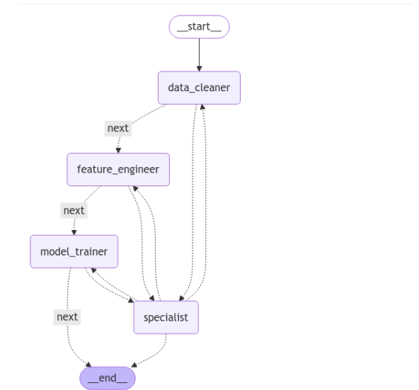
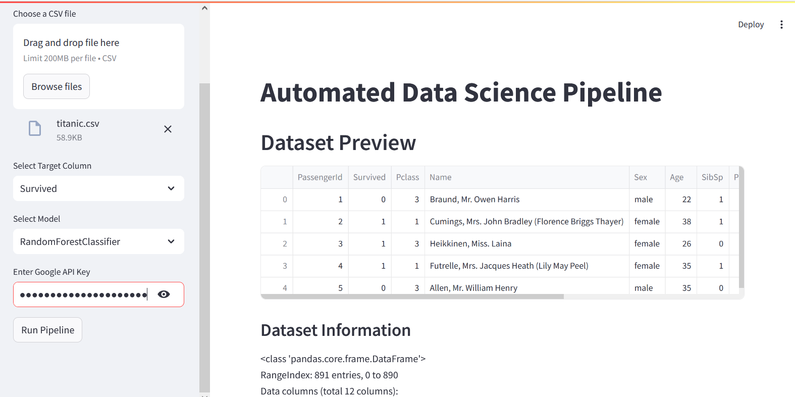

# ML Model Generator Web App

An AI-powered web application that automates the entire machine learning workflow from data cleaning to model training. The application uses Google's Gemini 1.5 Pro LLM to automatically clean data, engineer features, and train machine learning models.

## Features

- **CSV Upload**: Upload your dataset in CSV format
- **Data Cleaning**: Automatically detects and handles missing values, outliers, and data type issues
- **Feature Engineering**: Automatically creates new features and transforms existing ones
- **Model Training**: Trains ML models (currently supports Random Forest Classifier and Logistic Regression)
- **Model Evaluation**: Displays accuracy, precision, and recall metrics
- **Model Download**: Download the trained model for later use
- **Processing Logs**: View detailed logs of each processing step

## Prerequisites

- Python 3.8+
- Google Gemini API key

## Installation

1. Clone this repository
2. Install dependencies:
   ```
   pip install -r requirements.txt
   ```
3. Run the application:
   ```
   Streamlit run app.py
   ```

## Usage

1. Open the web application in your browser (default: http://127.0.0.1:5000/)
2. Upload your CSV file
3. Enter your Google Gemini API key
4. Specify the target variable (column to predict)
5. Select the ML model type
6. Review settings and click "Process Data"
7. View results and download your trained model

## Project Structure

```
ml-model-generator/
│
├── app.py                 # Main Flask application
├── templates/             # HTML templates
│   ├── index.html         # Home page
│   ├── confirm.html       # Settings confirmation page
│   ├── results.html       # Results page
│   └── logs.html          # Processing logs page
│
├── static/                # Static files
│   └── css/               # CSS stylesheets
│       └── style.css      # Main stylesheet
│
├── uploads/               # Directory for uploaded files (created automatically)
└── requirements.txt       # Python dependencies
```

## How It Works

The application uses a directed graph workflow powered by LangGraph and LangChain:

1. **Data Cleaning**: The LLM analyzes the dataset and generates Python code to clean it
2. **Feature Engineering**: The LLM creates and transforms features
3. **Model Training**: The LLM generates code to train the selected model
4. **Error Handling**: If any step fails, a specialist node attempts to fix the issue

## Security Notes

- API keys are not stored persistently
- Uploaded files are stored temporarily and associated with a unique session ID
- Data is processed locally, not sent to external services (except for LLM prompts)

## Contributing

Contributions are welcome! Please feel free to submit a Pull Request.

## License

This project is licensed under the MIT License - see the LICENSE file for details.


## Project workflow



## UI IMages

